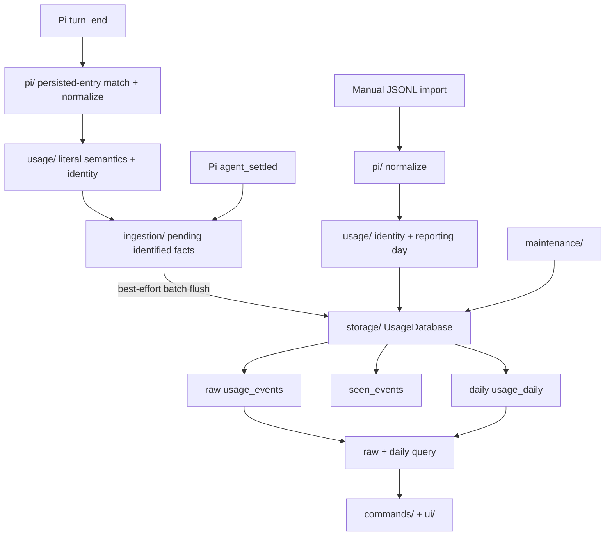

# Architecture

The system is a local usage ledger with two ingest paths, a process-local realtime durability boundary, and one analytics read model.

## Ownership

| Module | Owns | Must not own |
|---|---|---|
| `usage/` | literal usage semantics, event identity, reporting calendar, query DTOs | Pi APIs, JSONL traversal, SQLite, TUI |
| `pi/` | Pi event/session translation and persisted-entry matching | persistence timing, lock policy, accounting reinterpretation |
| `ingestion/` | process-local pending realtime facts, batch flush boundary, bounded best-effort loss | Pi message parsing, SQL/schema, durable recovery |
| `storage/` | schema, migrations, exact dedup, batch transactions, raw/daily mixed queries, compact transactions | Pi lifecycle or user interaction |
| `maintenance/` | explicit import/compact/storage workflows | hidden background jobs |
| `ui/` | themed overlay dashboard, terminal rendering, formatting, responsive presentation | persistence or accounting rules |
| `commands/` | `/usage` routing and interaction state | database internals |

`UsageDatabase` is intentionally a deep module rather than a repository interface: SQLite-specific concurrency, migrations, dedup, compaction, and mixed queries are one cohesive knowledge boundary. There is no second storage implementation to abstract over.

`RealtimeUsageBuffer` is intentionally shallow in feature count but has a distinct ownership boundary: it separates *capturing a fact* from *when durable persistence is worth attempting*. It is not a generic message queue and must not grow into a second persistence system.

## Dependency rule

`usage/` depends only on platform primitives. Pi integration may depend on `usage/`; ingestion may depend on `usage/` and the narrow `UsageDatabase` batch API; storage may depend on `usage/`; UI consumes query results. No module may reach through `UsageDatabase` to operate on tables directly.
