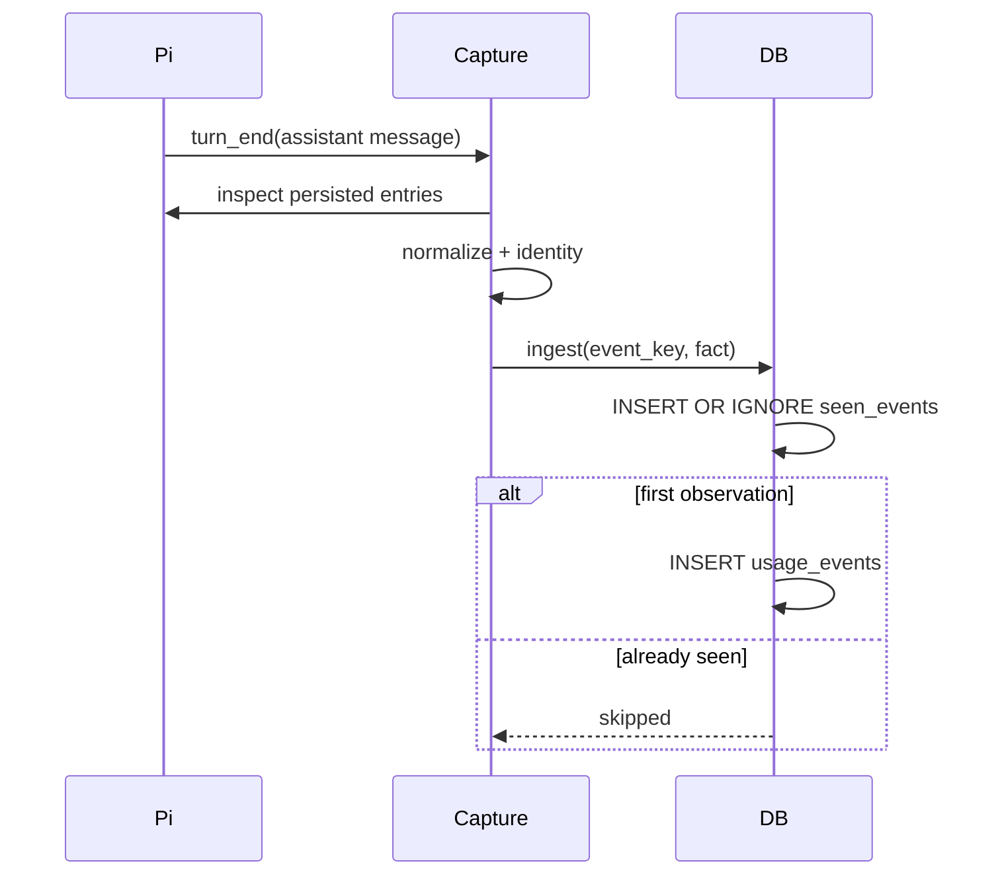

# Usage data lifecycle

## Canonical event

A canonical event is one attributable Pi assistant response. Its model identity and usage numbers are literal Pi fields; see `src/usage/SPEC.md`.

Realtime capture waits for `turn_end` so the corresponding assistant entry is already persisted. History import reconstructs the same canonical facts from JSONL. Both paths call the same identity and database ingest rules.

Session IDs are provenance only. They cannot be identity because Pi clones copied historical entries into new session files while retaining the same actual model response.

## Raw and compacted history

`usage_events` is optional long-term detail; `usage_daily` is permanent analytics detail. `seen_events` is permanent identity detail.

Queries combine both physical representations before grouping. This prevents compaction from turning a day into a closed state and makes late history import safe.

## Reporting timezone

The first database creation stores one IANA timezone. Raw timestamps remain absolute UTC milliseconds; `local_day` is derived once using the reporting timezone. Day-level destructive compaction makes silently following later OS timezone changes incorrect, so v1 has no automatic timezone switching.

## Failure boundaries

Capture failure must not fail the Pi agent loop. The extension emits a throttled warning and leaves the event absent; a later manual history import can recover it if the session entry was persisted.

A compact failure rolls back only the current day. Earlier completed days remain valid because each day is independently atomic and mixed raw/daily querying is always supported.
