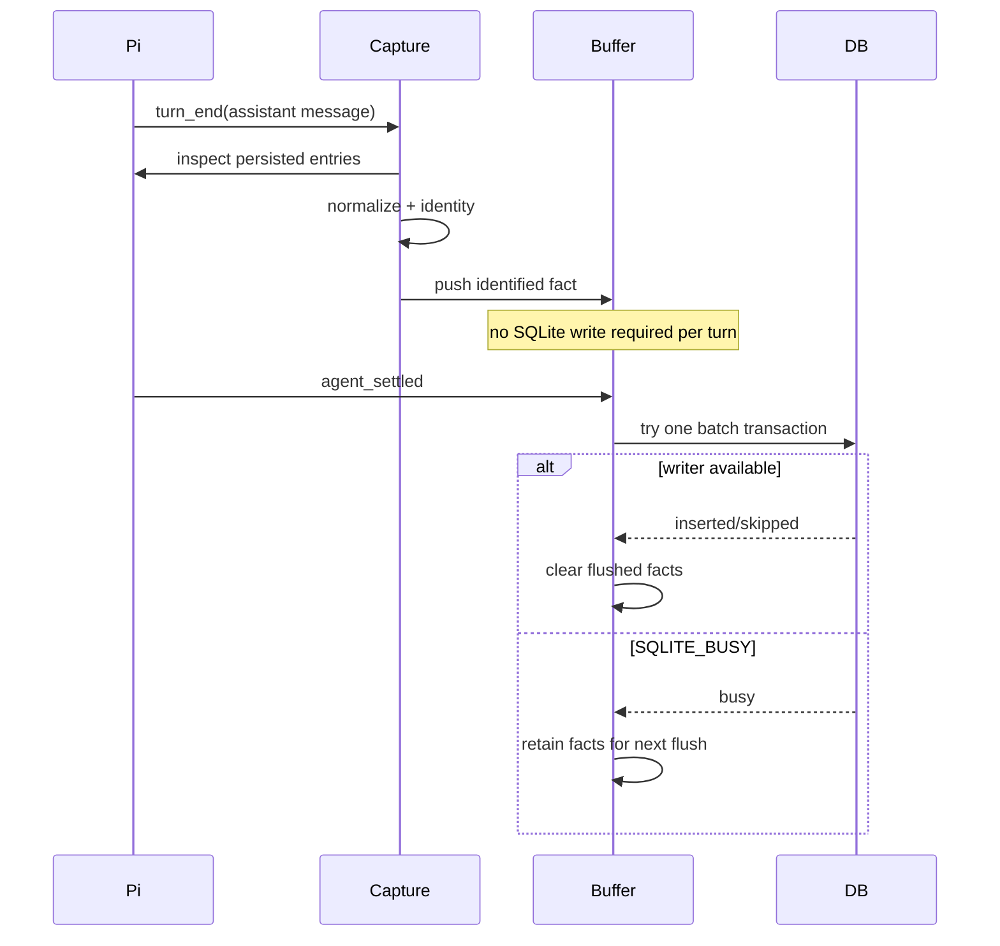

# Usage data lifecycle

## Canonical event

A canonical event is one attributable Pi assistant response. Its model identity and usage numbers are literal Pi fields; see `src/usage/SPEC.md`.

Realtime capture waits for `turn_end` so the corresponding assistant entry is already persisted. History import reconstructs the same event identity from JSONL. Session IDs are provenance only and cannot participate in canonical identity because copied sessions can contain the same already-paid model response.

## Realtime durability boundary

Realtime and history import intentionally have different durability behavior.

The primary flush boundary is `agent_settled`, not each tool-driven turn. This amortizes SQLite writer-lock acquisition while preserving one identity per assistant response.

Realtime persistence is best-effort telemetry. A process can exit with pending facts still only in memory, and an extended writer conflict can eventually cause the bounded buffer to drop old pending facts. This is accepted loss rather than a reason to block Pi or add a second durable queue. Manual history import is the recovery path because the corresponding assistant entries were already persisted by Pi before `turn_end`.

## Raw and compacted history

`usage_events` is optional long-term detail; `usage_daily` is permanent analytics detail. `seen_events` is permanent identity detail.

Queries combine both physical representations before grouping. This prevents compaction from turning a day into a closed state and makes late history import safe.

## Reporting timezone

The first database creation stores one IANA timezone. Raw timestamps remain absolute UTC milliseconds; `local_day` is derived using the reporting timezone when a fact reaches durable storage. Day-level destructive compaction makes silently following later OS timezone changes incorrect, so v1 has no automatic timezone switching.

## Failure boundaries

Capture/flush failure must not fail the Pi agent loop. `SQLITE_BUSY` during realtime flush is an expected eventual-consistency state and normally remains silent; the pending batch is retained for a later flush opportunity.

Non-busy capture/storage failures emit a throttled warning. A compact failure rolls back only the current day. Earlier completed days remain valid because each day is independently atomic and mixed raw/daily querying is always supported.
