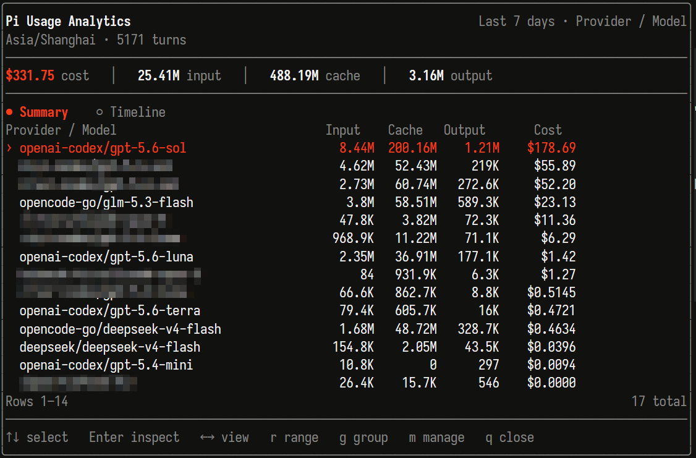
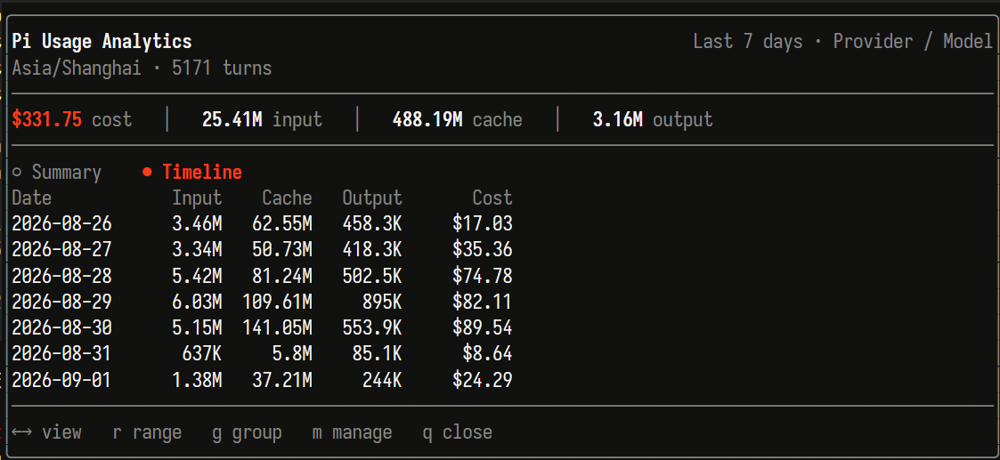
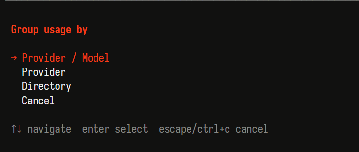
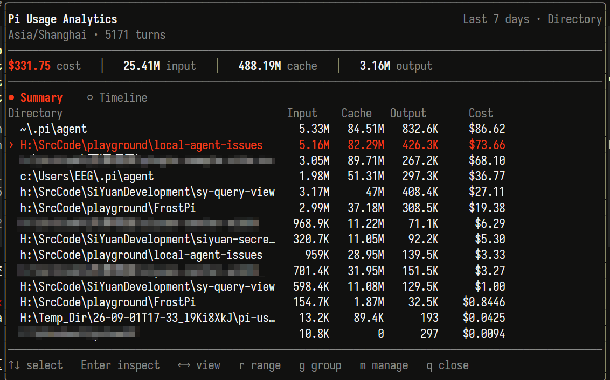
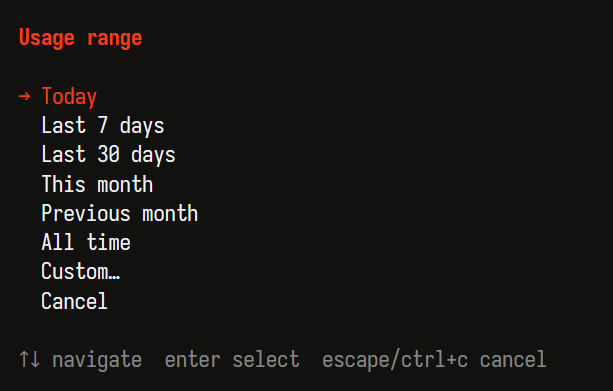

# Pi Usage Analytics

Track your token and cost usage across providers, models, and working directories. Open the dashboard anytime with `/usage`.




## Install

Requires Pi `0.84.x` and Node `>=22.19.0`.

```bash
pi install git:github.com/frostime/pi-usage-analytics
```

Try a local checkout without installing:

```bash
pi -e .
```

## Use

Run `/usage` in Pi. The dashboard opens as a centered overlay. Navigate with the keyboard:

| Key | Action |
|---|---|
| `↑/↓` | Select a row |
| `Enter` | Inspect that item over the timeline |
| `←/→` | Switch between Summary and Timeline |
| `r` | Change time range (today, 7d, 30d, month, custom) |
| `g` | Group by Provider / Model, Provider, or Directory |
| `m` | Maintenance menu (import, compact, storage) |
| `q` | Close |

Power-user shortcuts:

```text
/usage import    # Import past usage from Pi session history
/usage compact   # Compress old raw events into daily aggregates
/usage storage   # Reclaim unused database space
/usage help      # Show all commands
```

## Features

**Group by what matters.** Switch between Provider/Model, Provider only, or Directory to see where your tokens go.



**Directory view** shows usage per working directory. Useful when you work across multiple projects.



**Timeline** shows daily totals so you can spot trends or spikes.

**Time range** covers today, last 7/30 days, this/previous month, all time, or a custom range.



**Import history** scans your Pi session files and backfills usage you used before installing this extension. It deduplicates against already-recorded events, so running it multiple times is safe.

**Compact old data** converts raw event rows into permanent daily aggregates. After compaction you keep day-level totals and breakdowns, but lose per-message detail. A preview is shown before anything is deleted.

## Data & Privacy

Everything is stored locally in a SQLite database:

```text
~/.pi/agent/usage-analytics/usage.db
```

`PI_CODING_AGENT_DIR` is respected if set.

The ledger stores only usage metadata: provider, model, token counts, estimated cost, working directory, and timestamp. It does **not** store prompt text, assistant responses, thinking content, tool arguments, or tool output.

## Technical Details

**Concurrency.** The database uses SQLite WAL mode, so multiple Pi processes can share one file. Writers are serialized by SQLite; readers do not block.

**Realtime capture.** Usage events are buffered in memory and flushed as a batch at `agent_settled`. If the database is locked by another process, the buffer keeps the pending batch and retries later. This means Pi never waits on analytics I/O. In the rare case of a sudden crash, the last few events in the buffer may be lost; `/usage import` can recover them from session history.

**Time handling.** The database picks your system timezone at creation and keeps it for all calendar-day calculations. Event timestamps are stored as UTC. The timezone does not change if you later move your machine to a different zone, because old raw events may already have been compressed into day aggregates.

**Scope.** Headline totals count only assistant responses that Pi explicitly attributes to a provider and model. Tool-result-reported usage, compaction overhead, and branch summaries are excluded to avoid double-counting.

## Development

```bash
npm install
npm run check
npm run pack:dry
```

Developer documentation starts at `.dev/docs/index.md`. Module contracts live in `src/*/SPEC.md`. Root agent instructions are in `AGENTS.md`.

## License

MIT
